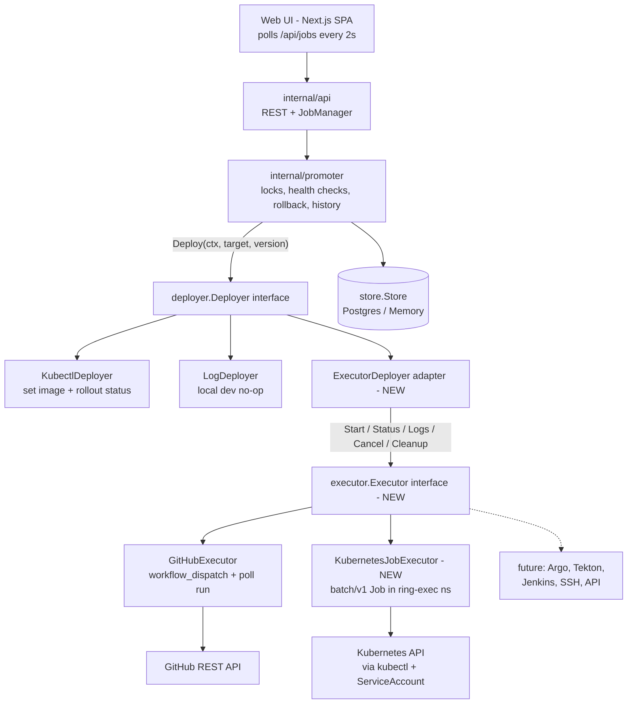
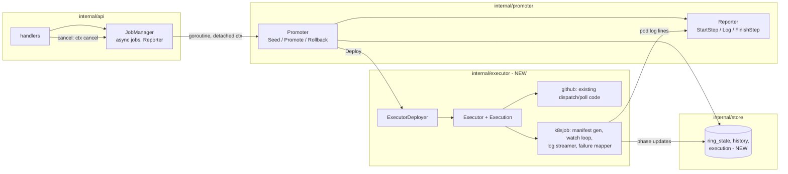
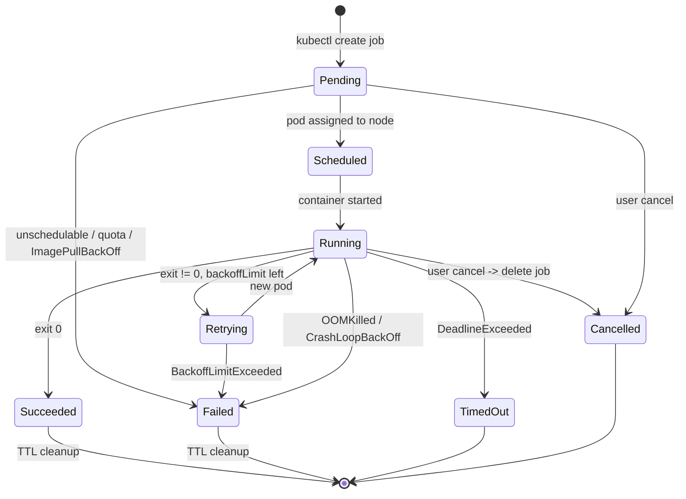
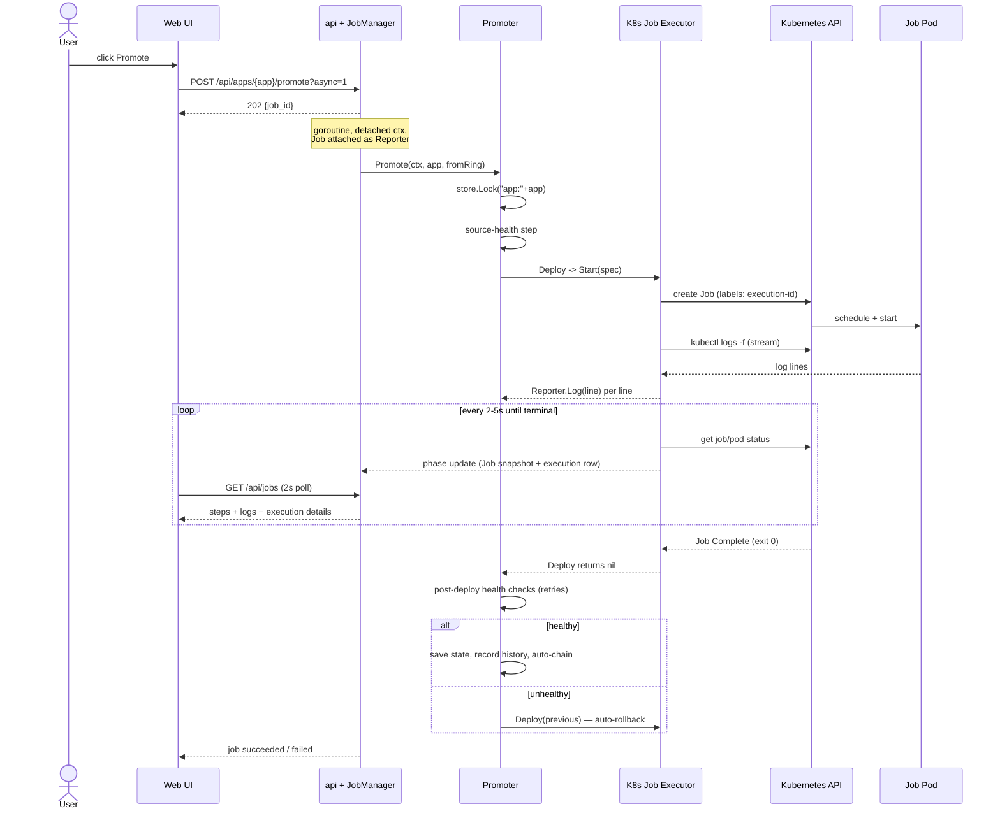
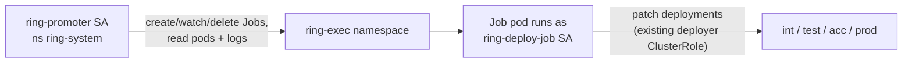
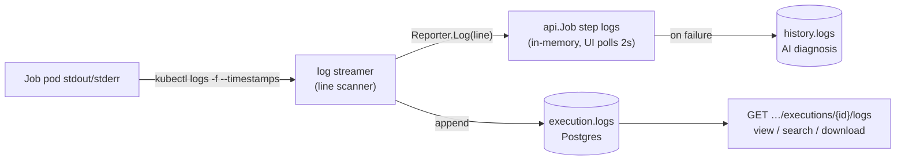

# Kubernetes Job Executor — Design

**Status:** Proposal · **Scope:** Make Ring Promoter execution-backend agnostic and add Kubernetes Jobs as a backend alongside GitHub Actions.

Ring Promoter today executes deployments through the `deployer.Deployer` interface
(`internal/deployer/deployer.go`), selected per app in config (`deployer: kubectl | github | log`).
This design grows that seam into a full **Executor** abstraction — start, watch, stream logs,
cancel, clean up — and adds a **Kubernetes Job** backend. The promotion engine
(`internal/promoter`) does not change: it keeps calling `Deploy(ctx, target, version)` and never
learns which backend ran the work.

**Key decisions, up front:**

1. **The promoter stays untouched.** A new `internal/executor` package defines the interface; a
   thin adapter (`ExecutorDeployer`) turns any Executor into a `deployer.Deployer`. All existing
   engine behavior — locks, health checks with retries, auto-rollback, history, auto-promote
   chaining — applies to Kubernetes Jobs for free.
2. **kubectl first, client-go later.** The repo deliberately has no Kubernetes SDK; `kubectl` is
   already baked into the image and authenticates via the pod's ServiceAccount. v1 drives Jobs
   through `kubectl` behind a small internal client interface, so swapping in client-go (for
   informers / multi-cluster scale) later touches one file, not the executor logic.
3. **Executions become durable.** A new `execution` table records every run (backend, Job name,
   pod, phase, exit code, logs). Jobs are labeled with an execution ID so a restarted control
   plane can re-attach to still-running Jobs instead of orphaning them.
4. **Cancellation is a first-class API.** A new cancel endpoint cancels the async job's context;
   the executor translates that into "delete the Kubernetes Job, kill the pod, mark cancelled."

---

## 1. Overall architecture



The dividing line: everything above `deployer.Deployer` knows about **promotions**
(apps, rings, versions, health). Everything below `executor.Executor` knows about **running a
task somewhere** (images, pods, workflow runs). The adapter in the middle is the only code that
knows both vocabularies.

## 2. Component interaction



New code lands in three places, matching the repo's existing layout:

| Location | Contents |
|---|---|
| `internal/executor/` | `executor.go` (interface, Spec, Status, phases), `deployer.go` (adapter), `github.go` (wraps the existing GitHub logic), `k8sjob/` (manifest builder, watcher, log streamer, failure mapper, kubectl client) |
| `internal/config/config.go` | `DeployerK8sJob` constant, `K8sJobConfig` struct, validation |
| `cmd/ringpromoter/main.go` | one new `case` in `buildDeployers` |

## 3. Executor interface design

The current `Deployer.Deploy` is one blocking call — fine for the engine, too coarse for
cancellation and log streaming. The Executor splits it into a **factory** and a **handle**:

```go
package executor

// Spec is everything a backend needs to run one deployment task.
// It is backend-agnostic: each backend ignores fields that don't apply,
// exactly as deployer.Target does today.
type Spec struct {
    // Identity — set by the adapter, used for labels, reattach, and the UI.
    ID     string // unique execution id (e.g. "exc-20260717-8f3a")
    App    string
    Ring   string
    Action string // seed | promote | rollback

    // What to run.
    Image   string
    Command []string
    Args    []string
    Env     map[string]string // RP_* contract vars + custom variables/parameters

    // Referenced, never inlined — see §9 Security.
    EnvFromSecrets    []string
    EnvFromConfigMaps []string
    ImagePullSecrets  []string

    // Placement and limits (Kubernetes-flavored; others ignore).
    Namespace      string
    ServiceAccount string
    Resources      Resources         // CPU/memory requests + limits
    NodeSelector   map[string]string
    Tolerations    []Toleration
    Affinity       string            // optional raw YAML passthrough

    // Lifecycle.
    Timeout        time.Duration // job activeDeadlineSeconds / overall wait bound
    Retries        int           // backoffLimit
    TTLAfterFinish time.Duration // ttlSecondsAfterFinished

    Labels      map[string]string
    Annotations map[string]string
}

// Executor starts executions. One per backend, built at startup in main.go.
type Executor interface {
    Start(ctx context.Context, spec Spec) (Execution, error)
}

// Execution is a handle on one running task.
type Execution interface {
    ID() string
    Status(ctx context.Context) (Status, error)
    Logs(ctx context.Context, opts LogOptions) (io.ReadCloser, error)
    Cancel(ctx context.Context) error
    Cleanup(ctx context.Context) error
}

type Phase string

const (
    PhasePending   Phase = "pending"   // accepted, not yet scheduled
    PhaseScheduled Phase = "scheduled" // pod assigned to a node
    PhaseRunning   Phase = "running"
    PhaseRetrying  Phase = "retrying"  // attempt failed, backoffLimit not exhausted
    PhaseSucceeded Phase = "succeeded"
    PhaseFailed    Phase = "failed"
    PhaseCancelled Phase = "cancelled"
    PhaseTimedOut  Phase = "timed_out"
)

func (p Phase) Terminal() bool // succeeded/failed/cancelled/timed_out

type Status struct {
    Phase    Phase
    Message  string            // human-readable, e.g. "image pull failed for ghcr.io/…"
    ExitCode *int              // container exit code when known
    Details  map[string]string // backend extras: job_name, pod_name, node, run_url…
}

type LogOptions struct {
    Follow     bool
    Since      time.Time // resume point for reconnects
    Timestamps bool
}
```

**The adapter** is what keeps the promoter ignorant of all this:

```go
// ExecutorDeployer adapts an Executor to deployer.Deployer.
// specFor maps the promotion vocabulary (Target, version) to the
// execution vocabulary (Spec) using the app's config.
type ExecutorDeployer struct {
    exec    executor.Executor
    specFor func(t deployer.Target, version string) executor.Spec
    poll    time.Duration
}

func (d *ExecutorDeployer) Deploy(ctx context.Context, t deployer.Target, version string) error {
    ex, err := d.exec.Start(ctx, d.specFor(t, version))
    if err != nil { return err }
    defer ex.Cleanup(context.WithoutCancel(ctx))

    go d.pumpLogs(ctx, ex)          // lines -> promoter.Reporter (the live step log)
    st, err := d.await(ctx, ex)     // poll Status; on ctx.Done: ex.Cancel, phase=cancelled
    if err != nil { return err }
    if st.Phase != executor.PhaseSucceeded {
        return fmt.Errorf("%s: %s", st.Phase, st.Message)
    }
    return nil
}
```

Both backends satisfy the same interface:

- **GitHubExecutor** — a refactor, not a rewrite. The existing `dispatch` / `findRun` /
  `waitForRun` in `internal/deployer/github.go` become `Start` / `Status`; `Cancel` calls
  `POST /repos/{o}/{r}/actions/runs/{id}/cancel`; `Logs` can return "not supported" at first
  (the UI already shows step-level progress) and later serve the run-logs archive.
  `GitHubActionsDeployer` becomes an `ExecutorDeployer` with a GitHub spec mapper — its
  existing tests (`github_test.go`) keep passing, which is the proof the refactor is safe.
- **KubernetesJobExecutor** — new, detailed below.

Optional capabilities stay optional, following the repo's existing pattern
(`LiveVersioner`, `VersionSource` are type-asserted, not required).

## 4. Kubernetes Job lifecycle



The Job's own controls map 1:1 onto Spec fields: `backoffLimit` ← `Retries`,
`activeDeadlineSeconds` ← `Timeout`, `ttlSecondsAfterFinished` ← `TTLAfterFinish`.
Kubernetes enforces them even if the control plane restarts mid-run.

## 5. Sequence diagram — promote via Kubernetes Job



Cancellation is the same picture with one extra arrow: `POST …/jobs/{id}/cancel` →
JobManager cancels the goroutine's context → the executor's wait loop sees `ctx.Done()` →
`kubectl delete job` (foreground propagation kills the pod) → phase `cancelled` → the promoter
records a failure history entry and stops the chain.

## 6. Data model changes

New durable record, one per execution attempt (Go struct in `internal/store/store.go`):

```go
type Execution struct {
    ID        string            // "exc-…", also the k8s label value
    App       string
    Ring      string
    Action    string            // seed | promote | rollback
    Backend   string            // github | k8sjob
    Phase     string            // executor.Phase
    Message   string
    ExitCode  *int
    Details   map[string]string // job_name, namespace, pod_name, node, cluster, run_url
    Logs      string            // full text, trimmed like history failure logs
    HistoryID *int64            // links to the history entry once recorded
    CreatedAt, StartedAt, FinishedAt time.Time
}
```

`store.Store` gains four methods (both Postgres and Memory implement them):
`CreateExecution`, `UpdateExecution`, `GetExecution`, `ListExecutions(app, limit)`.

The in-memory `api.Job` view gains an `execution` block so the UI can show backend details
without a second request. Ring state and history are unchanged.

## 7. API changes

| Method | Path | Purpose |
|---|---|---|
| POST | `/api/apps/{app}/jobs/{id}/cancel` | Cancel a running async job (and its execution) |
| GET | `/api/apps/{app}/executions` | Recent executions for an app (paged) |
| GET | `/api/apps/{app}/executions/{id}` | One execution incl. details, no logs |
| GET | `/api/apps/{app}/executions/{id}/logs` | Full logs, `text/plain`; `?download=1` sets attachment headers |

Existing endpoints are extended, not changed: the `GET /api/jobs` / `GET …/jobs/{id}` payload
gains

```json
"execution": {
  "id": "exc-20260717-8f3a", "backend": "k8sjob",
  "namespace": "ring-exec", "job_name": "rp-myapp-test-8f3a",
  "pod_name": "rp-myapp-test-8f3a-x7k2q", "node": "k3s-worker-2",
  "cluster": "k3s1", "phase": "running", "exit_code": null,
  "retries": 0, "started_at": "…", "finished_at": null
}
```

Live logs keep flowing through the existing mechanism — executor log lines are written to the
promoter `Reporter`, which the UI already polls every 2 s (`web/src/lib/queries.ts`). No SSE or
websockets needed for v1; the executions/logs endpoints add history, download, and reconnect.

## 8. Database changes

Appended to `internal/store/schema.sql` (idempotent, matching the existing migration style):

```sql
CREATE TABLE IF NOT EXISTS execution (
    id          TEXT PRIMARY KEY,
    app         TEXT NOT NULL,
    ring        TEXT NOT NULL,
    action      TEXT NOT NULL,
    backend     TEXT NOT NULL,
    phase       TEXT NOT NULL,
    message     TEXT NOT NULL DEFAULT '',
    exit_code   INTEGER,
    details     TEXT NOT NULL DEFAULT '{}',  -- JSON object
    logs        TEXT NOT NULL DEFAULT '',
    history_id  BIGINT,
    created_at  TIMESTAMPTZ NOT NULL DEFAULT now(),
    started_at  TIMESTAMPTZ,
    finished_at TIMESTAMPTZ
);

CREATE INDEX IF NOT EXISTS idx_execution_app_created
    ON execution (app, created_at DESC);
```

Log retention mirrors history: keep full logs for the newest `KeepFailureLogs` failures per app
plus any execution still running; older rows keep metadata but drop `logs`. A nightly sweep
also deletes execution rows older than a configurable retention window (default 90 days).

## 9. RBAC design

Two identities, deliberately separate, so a compromised deploy script cannot touch other
namespaces or the control plane:



Additions to `deploy/k8s/rbac.yaml`:

```yaml
# Namespace where all executor Jobs run.
apiVersion: v1
kind: Namespace
metadata:
  name: ring-exec
---
# Control plane may manage Jobs and read logs — in ring-exec only.
apiVersion: rbac.authorization.k8s.io/v1
kind: ClusterRole
metadata:
  name: ring-promoter-executor
rules:
  - apiGroups: ["batch"]
    resources: ["jobs"]
    verbs: ["create", "get", "list", "watch", "delete"]
  - apiGroups: [""]
    resources: ["pods"]
    verbs: ["get", "list", "watch"]
  - apiGroups: [""]
    resources: ["pods/log"]
    verbs: ["get"]
---
apiVersion: rbac.authorization.k8s.io/v1
kind: RoleBinding
metadata:
  name: ring-promoter-executor
  namespace: ring-exec           # scoped: not cluster-wide
subjects:
  - kind: ServiceAccount
    name: ring-promoter
    namespace: ring-system
roleRef:
  kind: ClusterRole
  name: ring-promoter-executor
  apiGroup: rbac.authorization.k8s.io
---
# Identity for the Job pods themselves.
apiVersion: v1
kind: ServiceAccount
metadata:
  name: ring-deploy-job
  namespace: ring-exec
# ring-deploy-job gets RoleBindings to the EXISTING ring-promoter-deployer
# ClusterRole in int/test/acc/prod — only if the deploy script needs to
# touch Deployments. Scripts that only call external APIs need no bindings.
```

Principles: no cluster-admin anywhere; the control plane cannot exec into pods; secrets are
mounted into Job pods via `envFrom.secretRef` (they live in `ring-exec`, created by ops, never
written by Ring Promoter); `ImagePullSecrets` referenced by name in config.

## 10. Failure handling strategy

The executor's watcher inspects Job conditions **and** pod/container statuses, then maps raw
Kubernetes signals to phases and messages a person can act on:

| Kubernetes signal | Where it appears | Phase | Message shown to the user |
|---|---|---|---|
| `PodScheduled=False` | pod condition | `pending` → `failed` after grace period | "cannot schedule pod: {reason} — check node selectors/resources" |
| `ErrImagePull` / `ImagePullBackOff` | container waiting reason | `failed` (after 2 min grace) | "image pull failed for {image}: {message}" |
| `CrashLoopBackOff` | container waiting reason | `retrying` / `failed` | "container crashing repeatedly, last exit code {n}" |
| `OOMKilled` | container terminated reason | `failed` | "out of memory — memory limit was {limit}" |
| `DeadlineExceeded` | Job condition | `timed_out` | "timed out after {timeout}" |
| `BackoffLimitExceeded` | Job condition | `failed` | "failed after {n} attempts, last exit code {c}" |
| non-zero exit | container terminated | `failed` | "deploy script exited with code {c}" |
| API/network error | kubectl/client error | *(retried)* | transient errors retried with backoff (same policy as the GitHub deployer's `do()`); persistent → `failed` with the API error |

Whatever the failure, the contract with the promoter is one error string — which then triggers
the **existing** failure machinery: failure history entry (with logs attached for AI
diagnosis), auto-rollback of the target ring, chain stop. Nothing new to build there.

## 11. Logging architecture



- **Live:** one `kubectl logs -f --timestamps` subprocess per running execution; each line goes
  to `Reporter.Log`, so the existing `job-progress.tsx` step panel shows it with no UI rework.
- **Reconnect:** if the stream drops while the Job still runs, restart with
  `--since-time={last seen timestamp}` — no lines lost, no duplicates.
- **History:** the full text lands in `execution.logs` (bounded — last ~1 MiB per execution),
  surviving restarts and TTL-deleted pods. Failure logs additionally flow into history for the
  existing "Diagnose with AI" feature.
- **Search & download:** the UI searches within the loaded log text client-side; the logs
  endpoint serves the full plain-text file for download.
- **Multi-attempt:** on retry, the streamer follows the newest pod and writes an attempt
  separator line, so retried runs read as one continuous story.

## 12. Status synchronization

One **watch loop** goroutine per active execution, owned by the executor:

1. Poll `kubectl get job -o json` + the newest pod's status every 2–5 s (matching the UI's own
   2 s poll — faster would be invisible).
2. Derive the phase (per §10), and on every transition: update the `execution` row, emit a
   `Reporter` line ("pod scheduled on k3s-worker-2", "attempt 2 starting"), update the
   in-memory Job snapshot.
3. Stop on a terminal phase; run `Cleanup` (TTL usually beat us to it).

**Restart resilience:** every Job carries labels
`ring-promoter.io/execution-id`, `app`, `ring`. On startup, the control plane lists
non-terminal rows in `execution`, finds their Jobs by label, and re-attaches watch loops —
today an in-flight promotion dies silently with the process; with this, a Kubernetes-backed one
is recovered or at minimum correctly marked failed. If throughput ever outgrows polling,
the seam in §2 swaps the poll loop for client-go informers (one watch connection for all Jobs)
without touching phase mapping or the store.

## 13. UI wireframe suggestions

Executor choice is **configuration, not a per-promotion decision** — shown as a read-only badge
where the app's rings are displayed, and selectable only in an admin/app-settings context:

```
┌─ myapp · test ────────────────────────────────┐
│  v1.4.2   ● healthy         ☸ Kubernetes Job  │   ← backend badge on the ring card
│  [ Promote to acc ]  [ Seed ]      auto  (on) │      (⚡ GitHub Runner for github apps)
└───────────────────────────────────────────────┘
```

`job-progress.tsx` (already the live step view) gains an execution strip and a cancel action:

```
┌─ Promoting myapp: test → acc ───────────────── ● running · 01:42 ─┐
│  Executor  ☸ Kubernetes Job          [ Cancel promotion ]         │
│  Namespace ring-exec        Job   rp-myapp-acc-8f3a               │
│  Pod       …8f3a-x7k2q      Node  k3s-worker-2    Retries 0/2     │
│───────────────────────────────────────────────────────────────────│
│  ✓ source-health                                           2.1s   │
│  ▶ deploy                                                 1:38    │
│     ┌ logs ──────────────────────── [search…] [⤓ download] ┐      │
│     │ 12:04:11 pulling ghcr.io/bwalia/deploy-runner:v1     │      │
│     │ 12:04:19 applying manifests to acc…                  │      │
│     └────────────────────────────────────────────────────── ┘      │
│  ○ health-check                                                   │
└───────────────────────────────────────────────────────────────────┘
```

History entries link to their execution detail (backend, job/pod names, duration, exit code,
archived logs). All of this is additive to the existing dashboard components — no redesign.

## 14. Migration strategy from GitHub-only execution

Per-app and reversible at every step — the switch is one config field, and switching back
requires no data migration.

| Phase | What happens | Risk / rollback |
|---|---|---|
| **1. Extract the seam** | Add `internal/executor` + `ExecutorDeployer`; refactor the GitHub deployer's internals into `GitHubExecutor`. Zero behavior change — `github_test.go` and `promoter_test.go` must pass unmodified. | Pure refactor; revert the commit. |
| **2. Add the backend** | Implement `KubernetesJobExecutor` + config (`deployer: k8sjob`, `k8sjob:` block) + RBAC + a first runner image. Nothing selects it yet. | Dead code until configured. |
| **3. Make it durable** | `execution` table, cancel endpoint, UI execution strip. Benefits GitHub-backed apps too (cancel + durable records). | Additive schema; endpoints unused until UI ships. |
| **4. Pilot** | Flip **one** app's config to `deployer: k8sjob` — its `int` ring first, watching real promotions side by side with GitHub apps. | Flip the field back to `github`. |
| **5. Roll out** | Migrate apps where a Job fits (in-cluster targets); keep `github` where it fits better (VM targets reachable by existing runners). Mixed fleet is a supported end state, not a transition. | Per-app, same one-field rollback. |

## 15. Example Kubernetes Job manifest

What the executor generates for `promote myapp test→acc` (every field traces to a `Spec` field,
which traces to the app's `k8sjob:` config):

```yaml
apiVersion: batch/v1
kind: Job
metadata:
  name: rp-myapp-acc-8f3a            # rp-{app}-{ring}-{short exec id}
  namespace: ring-exec
  labels:
    app.kubernetes.io/managed-by: ring-promoter
    ring-promoter.io/execution-id: exc-20260717-8f3a
    ring-promoter.io/app: myapp
    ring-promoter.io/ring: acc
  annotations:
    ring-promoter.io/action: promote
    ring-promoter.io/version: v1.4.2
spec:
  backoffLimit: 2                     # Spec.Retries
  activeDeadlineSeconds: 1800         # Spec.Timeout
  ttlSecondsAfterFinished: 3600       # Spec.TTLAfterFinish
  template:
    metadata:
      labels:
        ring-promoter.io/execution-id: exc-20260717-8f3a
    spec:
      restartPolicy: Never            # retries via backoffLimit, not pod restarts
      serviceAccountName: ring-deploy-job
      imagePullSecrets:
        - name: ghcr-pull
      nodeSelector:
        kubernetes.io/arch: amd64
      containers:
        - name: deploy
          image: ghcr.io/bwalia/deploy-runner:v1
          command: ["/scripts/deploy.sh"]
          args: ["--mode", "full"]
          env:                        # the runner contract, injected by the executor
            - name: RP_APP
              value: myapp
            - name: RP_RING
              value: acc
            - name: RP_ACTION
              value: promote
            - name: RP_VERSION
              value: v1.4.2
            - name: RP_TARGET_ENV
              value: acc
            - name: RP_REPOSITORY
              value: bwalia/myapp
            - name: RP_BRANCH
              value: main
            - name: RP_EXECUTION_ID
              value: exc-20260717-8f3a
          envFrom:
            - secretRef:
                name: myapp-deploy-credentials
            - configMapRef:
                name: myapp-deploy-config
          resources:
            requests: { cpu: 250m, memory: 256Mi }
            limits:   { cpu: "1",  memory: 512Mi }
```

**The runner contract** is the portable heart of this: any image that reads `RP_*` variables
and exits 0/non-zero is a valid deployment script — the same contract a future Argo or SSH
executor would honor.

## 16. Production considerations

- **Concurrency & queueing.** The store's per-app advisory lock already serializes each app
  across replicas. Add a global semaphore (`k8sjob.max_concurrent`, default ~20): executions
  beyond it wait in `Start`, surfaced as a "queued" reporter line. Hundreds of concurrent Jobs
  are then a knob, not an incident.
- **API rate limiting.** Cap kubectl subprocess spawn rate; on API errors back off exponentially
  (reusing the GitHub deployer's retry policy shape).
- **Multi-cluster.** `Spec` and `execution.details` already carry `cluster`. Config grows
  `clusters: {name: kubeconfig_secret}`; the kubectl client passes `--kubeconfig/--context`.
  The interface doesn't change — this is deliberately deferred, not precluded.
- **Restart resilience.** Label-based re-attach (§12) — also the answer to "what if the control
  plane deploys itself mid-promotion."
- **Cleanup belt-and-braces.** TTL handles the happy path; a periodic sweep deletes orphaned
  `managed-by: ring-promoter` Jobs whose executions are terminal, and prunes old execution rows.
- **Runner image supply chain.** Version-pin runner images (no `:latest`), build them in CI, and
  treat a runner image bump like any other version change.
- **Observability.** Structured slog per transition (already the house style); counters worth
  exporting later: executions by backend/phase, duration, retry counts, queue depth.
- **Prod ring safety.** The existing prod-password gate and auto-promote-off-by-default on
  `acc` are backend-independent and continue to apply.

## 17. Trade-offs — GitHub Actions vs Kubernetes Jobs

| Dimension | GitHub Actions runner | Kubernetes Job |
|---|---|---|
| Startup latency | 10 s–minutes (queue + runner pickup) | Seconds (pod schedule) |
| External dependency | GitHub availability + API rate limits | None beyond the cluster itself |
| Reach | Can deploy to VMs/networks the runner sits in — the reason it exists here | Runs in-cluster; needs network reach to its target |
| Secrets | Live in GitHub; a second secret store to audit | Stay in the cluster, RBAC-scoped |
| Logs | On GitHub; fetched after the fact | Streamed live from the pod, archived locally |
| Cancellation | Best-effort API cancel | Immediate and reliable (delete Job → SIGTERM) |
| Retries/timeout | Workflow-author's job | Declarative on the Job spec, platform-enforced |
| Pipeline definition | Full workflow ecosystem, versioned in the app repo | One container image + script (simpler, less featureful) |
| Cost | Runner VMs / minutes | Existing cluster capacity |
| Best for | VM/CI apps with existing pipelines (wslproxy, iOS builds) | In-cluster apps, tight feedback loops, high volume |

The end state is both, chosen per app — which is exactly what the per-app `deployer:` field
already expresses.

## 18. Recommendations for a pluggable, maintainable execution engine

1. **One seam, guarded.** `executor.Spec`/`Status` must stay backend-agnostic — no Kubernetes
   types outside `internal/executor/k8sjob/`. Rule of thumb: if a field only one backend could
   ever use, it goes in that backend's config block, not in `Spec`.
2. **Registry over switch.** Replace the growing `switch` in `buildDeployers` with a
   `map[string]func(app config.AppConfig) (executor.Executor, error)`. A new backend registers
   a constructor + a config struct + validation, and touches nothing else.
3. **A conformance test suite.** A shared test harness that any `Executor` must pass —
   start-to-success, failure with exit code, cancel mid-run, timeout, log replay after
   reconnect — run against a fake for each backend (the `ghFake`/`httptest` pattern from
   `github_test.go`; a fake kubectl for k8sjob). This is what actually keeps "add a backend =
   implement the interface" true over time.
4. **Document the runner contract** (`RP_*` env in, exit code out, stdout as the log) in
   `docs/` as a first-class API. Every future backend — Argo, Tekton, Jenkins, SSH — reduces to
   "arrange for this contract to run somewhere."
5. **Degrade capabilities gracefully.** Optional powers (log streaming, live version, version
   listing) stay optional interfaces; the UI hides what a backend can't do instead of erroring.
6. **Keep the engine's guarantees central.** Health checks, retries-then-rollback, history, and
   locking live in the promoter and must never migrate into a backend — that's what keeps every
   backend equally safe to use.
