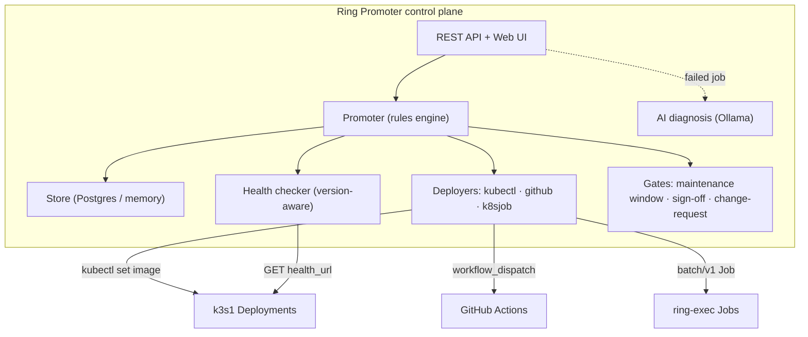
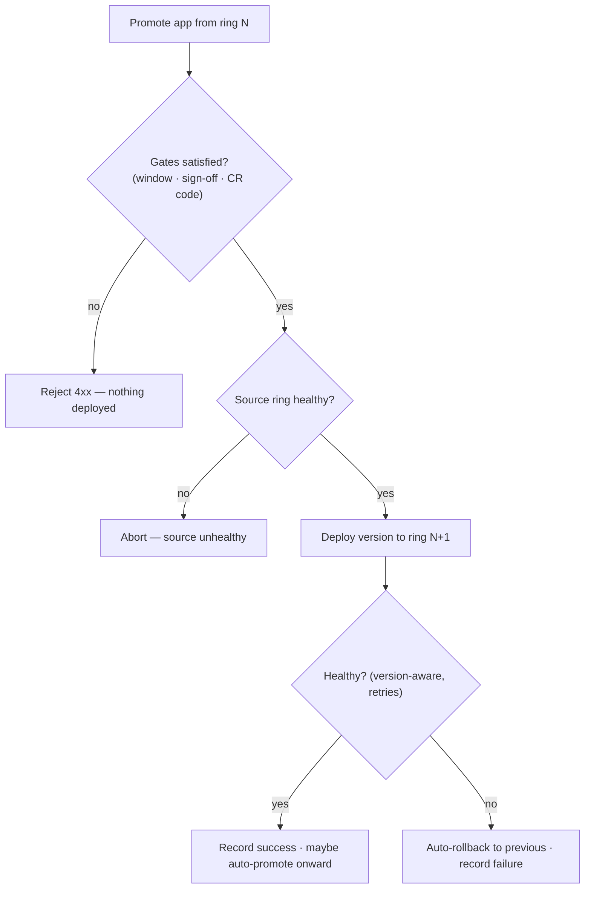

# Ring Promoter — architecture (training reference)

Ring Promoter is a small Go control plane with an embedded web UI. It promotes
an application's version through ordered **rings** (`int → test → acc → prod`),
one ring at a time, health-checking each hop and rolling back on failure.

## Components

## Promotion decision flow

## Key ideas the academy teaches

- **One ring at a time, never skip** — order is the single source of truth.
- **Version-aware health** — a ring is healthy only when its endpoint reports
  the *deployed* version (`health_version_field` / `health_version_header`); a
  stale replica answering `200 OK` fails.
- **Gates run before any deploy** — a closed gate leaves all state untouched.
- **Pluggable deployers** — the same promotion engine drives Kubernetes,
  GitHub Actions, and Kubernetes Jobs.

See the [sample-apps feature matrix](../sample-apps/README.md#feature-coverage-matrix)
for which app demonstrates each capability.
