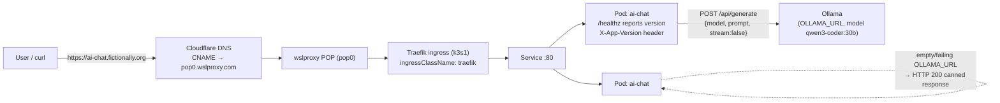
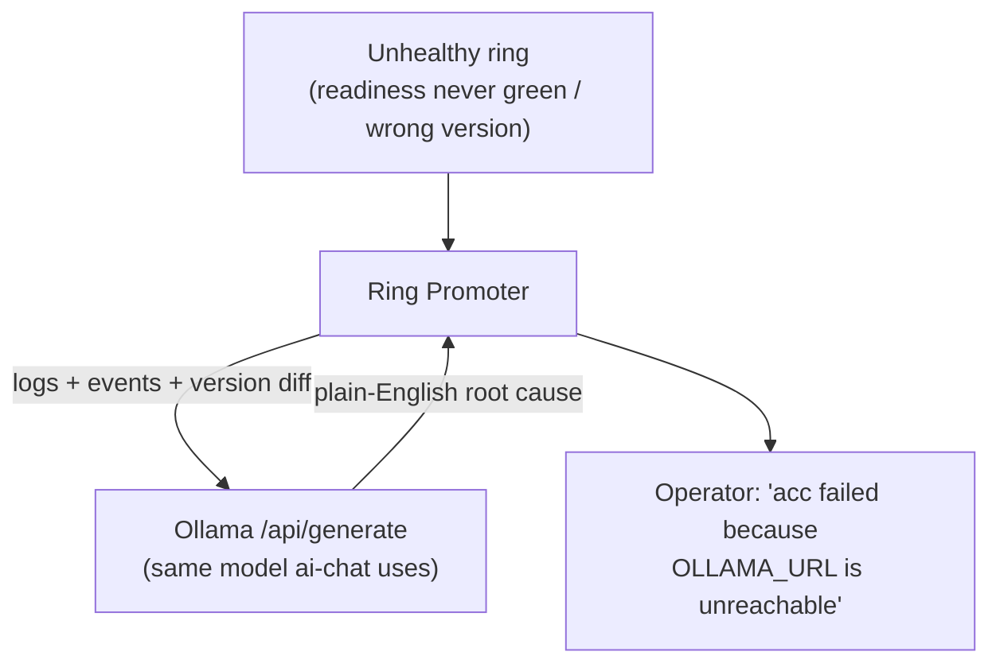

# ai-chat — architecture

A stateless Go HTTP service that proxies `POST /chat` to a local Ollama server.
It exists to demonstrate the AI-centric Ring Promoter features: **Ollama-based
failure diagnosis**, a **ref-pinned `acc` ring**, and **optional GPU
deployment** — while keeping the same build → seed → promote → health-check →
rollback loop as `hello-world`.

## Runtime shape



If `OLLAMA_URL` is empty or the upstream call fails, `/chat` returns a canned
`200` so the demo works with no GPU and no model.

## Promotion loop with the ref-pinned acc ring

```mermaid
sequenceDiagram
  participant CI as App CI (GitHub Actions)
  participant RP as Ring Promoter
  participant K as k3s1 (traefik)
  CI->>CI: build image :sha-abc123
  CI->>RP: POST /api/apps/ai-chat/seed {ring:int, version:sha-abc123}
  RP->>K: deploy sha-abc123 to int
  RP->>K: GET /healthz — must report version sha-abc123
  K-->>RP: {"status":"ok","version":"sha-abc123"}
  RP-->>CI: healthy ✓
  Note over RP,K: int → test track the promoted SHA
  RP->>RP: tag blessed candidate as `release`
  RP->>K: deploy acc — REF-PINNED to `release` (not the SHA)
  Note over RP,K: acc & prod always ship the `release` ref;<br/>if a ring stays unhealthy, Ring Promoter's Ollama<br/>diagnosis explains why, then auto-rollback
```

## AI failure-diagnosis (Ollama) tie-in



`ai-chat`'s ecosystem already runs Ollama, so the model that powers `POST /chat`
is the same one Ring Promoter calls to diagnose a failed promotion — making this
app the natural showcase for the feature.

## Why the version endpoint matters

`/healthz` echoes `RP_VERSION` and every response sets `X-App-Version`. The Ring
Promoter ring config sets `health_version_field: version`, so a ring only passes
once the endpoint is actually serving the promoted build — a stale replica
answering `200 OK` fails the check and is rolled back.

## GPU scheduling (optional)

The chart carries a templated GPU block — `nodeSelector`, `tolerations`, and a
`nvidia.com/gpu` resource request — rendered only when `gpu.enabled=true`. It is
disabled by default so the chart deploys on any node; enable it in a ring that
co-locates this proxy with an Ollama running on a GPU box.
