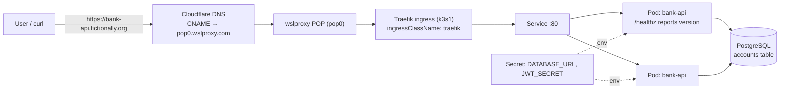
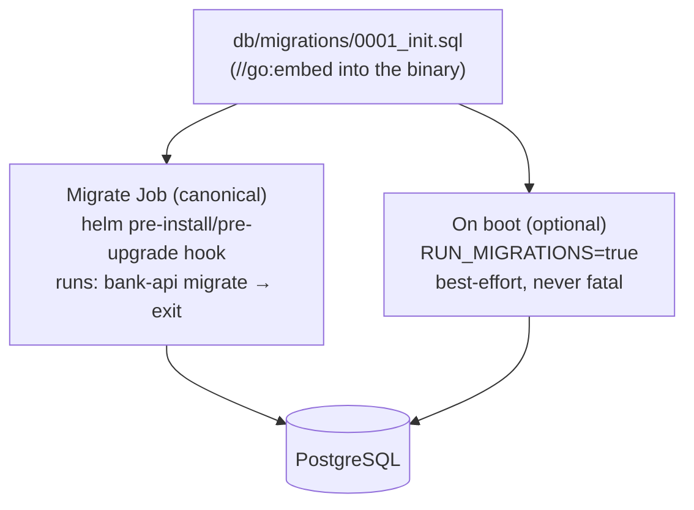
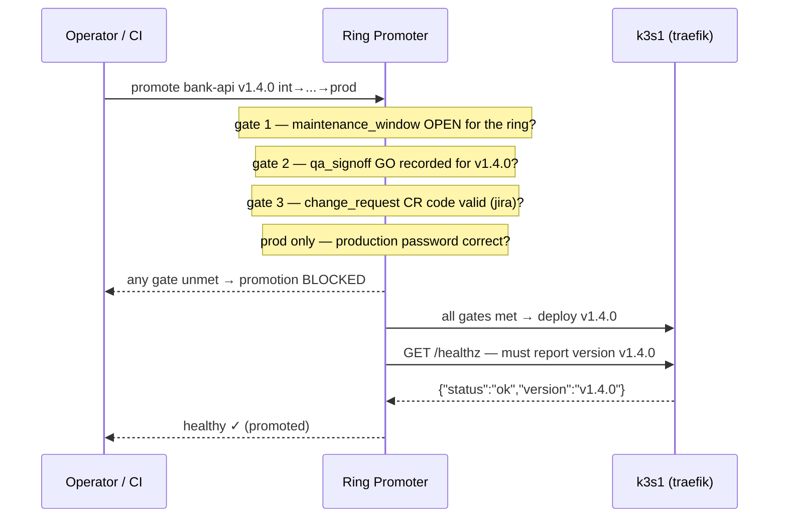

# bank-api — architecture

The **high-governance** Ring Promoter workload: a stateful HTTP service (Go +
PostgreSQL, JWT auth, database migrations) that exercises everything the
smallest app (hello-world) does not — a real dependency that can fail, secrets,
schema migrations, and all three promotion gates plus the production password.

## Runtime shape

- **Never crashes on a DB outage.** `sql.Open` opens a *lazy* pool, so boot
  never dials the database. A background prober keeps a `dbUp` flag current:
  `/readyz` returns `503` while the DB is unreachable, and balance reads fall
  back to a fixed demo value. `/healthz` (liveness + version) stays green
  throughout, so a DB blip does not trigger a pod restart storm.
- **Secrets, not literals.** `DATABASE_URL` and `JWT_SECRET` are injected from a
  Kubernetes Secret via `secretKeyRef` — never baked into the image or chart.

## Database migrations

`db/migrations/0001_init.sql` (accounts table + one seed row) is **embedded into
the binary** with `//go:embed db/migrations/*.sql`. Keeping the SQL inside the
image means there is exactly one source of truth — no ConfigMap copy that can
drift from what the app expects.

Two application paths, one migration set:

1. **Migrate Job — canonical.** `chart/templates/migrate-job.yaml` renders a
   `batch/v1` `Job` wired as a Helm `pre-install,pre-upgrade` hook. It runs the
   **app image** with the `migrate` argument (`bank-api migrate`), which waits
   up to 60s for the database, applies the embedded migrations, and exits.
   Because it is a hook it completes *before* the new Deployment rolls out, so
   pods only ever start against an already-migrated schema. The Job **fails
   loudly** (non-zero exit, `backoffLimit`) — unlike the server, which degrades.
2. **On boot — optional.** `RUN_MIGRATIONS=true` (chart:
   `migrations.runOnBoot`) makes the app apply migrations at startup. This is
   *best-effort*: it logs and continues if the DB is not up yet, so it never
   blocks or crashes boot. Handy for a single-pod lab; the Job is preferred
   whenever there is more than one replica (it avoids a migrate race).

The migration is idempotent (`CREATE TABLE IF NOT EXISTS`, `INSERT ... ON
CONFLICT DO NOTHING`), so all paths are safe to re-run. In production you would
swap the raw SQL for a real migration tool (golang-migrate / Flyway / Atlas)
with a version table; the mechanics stay the same.

## PostgreSQL

For training the chart ships `postgres:16-alpine` as an ephemeral
`Deployment`+`Service` (`emptyDir`, **data not persisted**), gated by
`postgres.enabled` (default `true`). In production set `postgres.enabled=false`
and point `DATABASE_URL` at a managed database. The app is storage-agnostic — it
only needs a DSN.

## Governance: why bank-api is the strict one

bank-api's Ring Promoter registration sets a `promotion_policy` that turns on
**all three gates**, and the pipeline's last ring (`prod`) also carries the
**production password**. A version cannot enter a guarded ring until *every*
applicable gate is satisfied — the checks are independent and additive.

| Gate                 | Source of truth                                     | How it opens                                                                 |
|----------------------|-----------------------------------------------------|------------------------------------------------------------------------------|
| `maintenance_window` | recurring config windows **∪** operator ad-hoc windows | "now" falls inside a configured recurring window **or** an operator opens one at runtime (`POST .../maintenance-windows`). |
| `qa_signoff`         | recorded sign-offs                                  | a release engineer records a **GO for the exact version** (`POST .../signoffs`). A sign-off for a different version does not count. |
| `change_request`     | provider `jira` (demo code `test` always accepted)  | a valid **CR code** accompanies the promotion; provider `jira` validates it against a JIRA issue (token from `RP_JIRA_TOKEN`). |
| production password  | Ring Promoter instance config                       | operator supplies the **production password** on any operation targeting `prod`. |

Concretely, promoting **into `acc`** requires an open maintenance window **+** a
GO sign-off for that exact version **+** a valid CR code. Promoting **into
`prod`** requires all of those **+** the production password. Miss any one and
Ring Promoter blocks the promotion before a single pod is touched.

## Why the version endpoint still matters

As with every academy app, `/healthz` echoes `RP_VERSION` and the ring config
sets `health_version_field: version`. Even after all the governance gates pass,
a promotion only counts as healthy once the endpoint actually serves the
promoted build — a stale replica answering `200 OK` fails the check and is
rolled back. Governance decides *whether* a version may deploy; the version
health check confirms it *actually* did.
