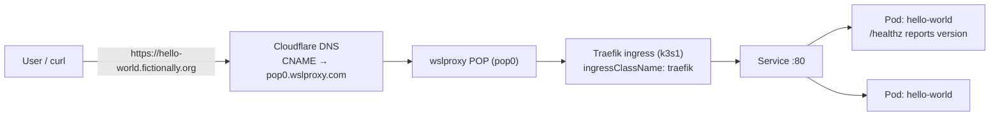
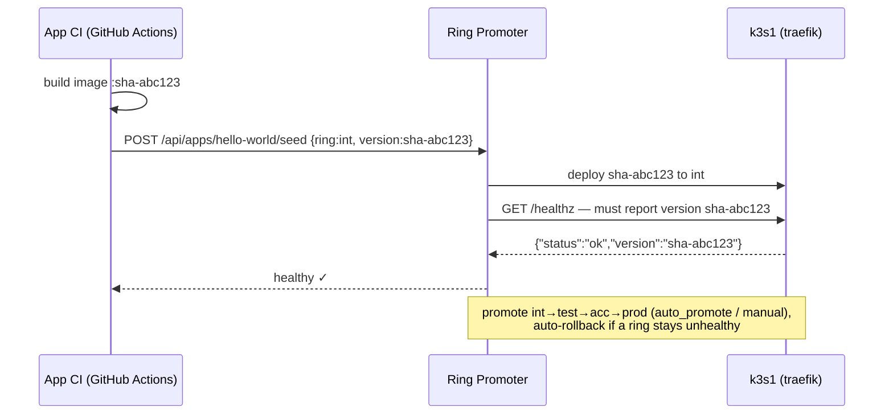

# hello-world — architecture

The smallest realistic Ring Promoter workload: one stateless HTTP service that
reports its own version. It exists to demonstrate the full loop — build → seed →
promote → health-check → rollback — with nothing else in the way.

## Runtime shape

## Promotion loop

## Why the version endpoint matters

`/healthz` echoes `RP_VERSION`. The Ring Promoter ring config sets
`health_version_field: version`, so a ring only passes once the endpoint is
actually serving the promoted build — a stale replica answering `200 OK` fails
the check and is rolled back. This is the single most important idea the
training academy teaches, and hello-world isolates it.
