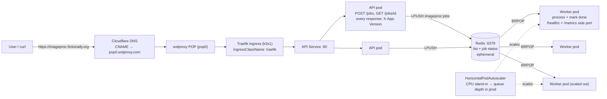
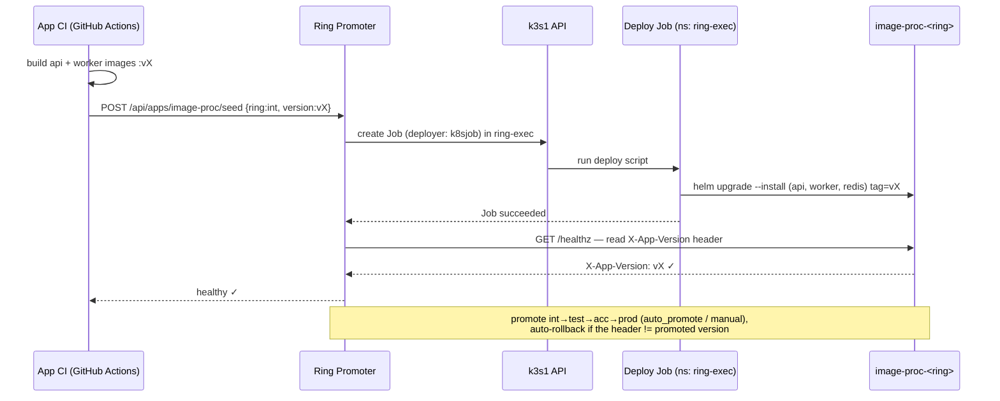

# image-proc — architecture

An async, queue-backed Ring Promoter workload. An API accepts jobs and enqueues
them onto a Redis list; a horizontally-scaled worker drains the list and
processes them. It demonstrates three things the smaller hello-world app does
not: an async producer/consumer split, worker **autoscaling**, and the
**header** variant of version-aware health (`X-App-Version`).

## Runtime shape



The worker has **no ingress** — only a side HTTP port for `/healthz` (liveness)
and `/metrics`. Producers and consumers are decoupled entirely through the Redis
list `imageproc:jobs`; job status lives at `imageproc:job:<id>`.

## Worker scaling

The chart ships an `autoscaling/v2` HorizontalPodAutoscaler targeting the worker
Deployment. In training it scales on **CPU** because that needs nothing beyond
`metrics-server`. In **production** an async worker should scale on **queue
depth** — the backlog is the real signal, not CPU burn — by exporting
`imageproc_queue_depth` to a custom/external metric source (Prometheus Adapter,
or KEDA's Redis scaler) and using an `External` metric like ~30 queued jobs per
replica. The stand-in and the production form are both documented inline in
[`chart/templates/worker-hpa.yaml`](./chart/templates/worker-hpa.yaml).

## Version-aware health — the header variant

Every API response, including `/healthz`, carries `X-App-Version: <version>`.
The Ring Promoter ring config sets `health_version_header: X-App-Version`
(instead of hello-world's `health_version_field: version`), so a ring passes
only once the endpoint is actually serving the promoted build. `/healthz` stays
`ok` even when Redis is down — Redis being unreachable makes `POST /jobs` return
`503`, but the API process itself is healthy and still reports its version.

## Promotion via the k8sjob deployer

image-proc uses Ring Promoter's **k8sjob deployer**: rather than Ring Promoter
running `helm`/`kubectl` in-process, each deploy is executed as a **Kubernetes
Job in the `ring-exec` namespace** running a deploy script. Deploy credentials
and tooling live in a short-lived pod per deploy.



## App-config shape (k8sjob)

The orchestrator wires the real Ring Promoter config; this is the shape it uses
(also in the [README](./README.md)):

```yaml
apps:
  - name: image-proc
    deployer: k8sjob
    health_version_header: X-App-Version
    k8sjob:
      namespace: ring-exec
      image: ghcr.io/bwalia/rp-training-deploy:latest
      command: ["/bin/sh", "-c", "helm upgrade --install image-proc ./chart --namespace image-proc-$RING --create-namespace --set image.tag=$VERSION"]
    rings:
      - { name: int,  auto_promote: true }
      - { name: test, auto_promote: true }
      - { name: acc,  auto_promote: false }
      - { name: prod, auto_promote: false }
```
