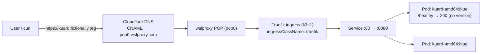
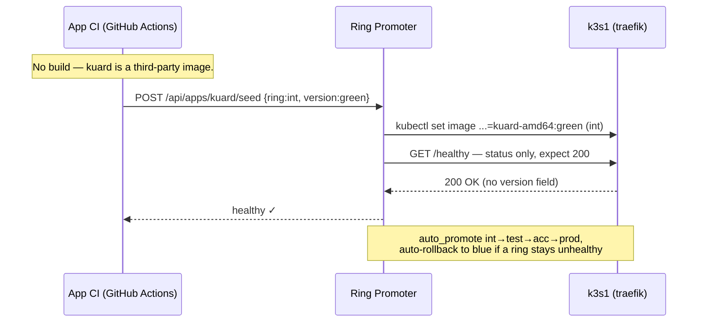

# kuard — architecture

The canonical Ring Promoter training workload: the upstream
`gcr.io/kuar-demo/kuard-amd64` image promoted **blue → green** by image tag. It
demonstrates promoting a **third-party image** with a **STATUS-ONLY** health
check — `/healthy` returns `200` and reports no version, so the deployed tag is
the only "version" that exists.

## Runtime shape

## Promotion loop (blue ↔ green)

## Why a STATUS-ONLY health check

kuard's `/healthy` endpoint answers `200 OK` with no version in the body, so
Ring Promoter's ring config sets **no** `health_version_field` — it can only
assert "a pod is up and serving". The promoted **image tag** (`blue`/`green`) is
therefore the source of truth for which build is live. This is the deliberate
contrast with `hello-world`: same promotion machinery, but here the app can't
prove its own version, so the health check is status-only and the tag carries
the identity.
