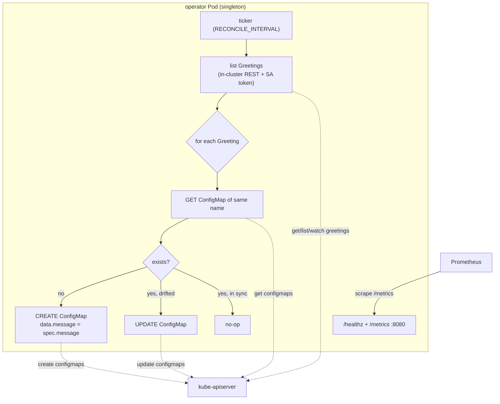
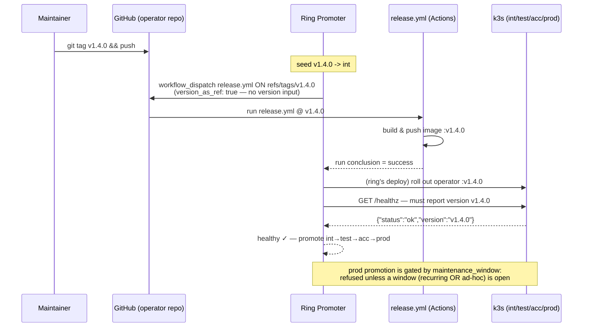

# operator — architecture

A minimal Kubernetes operator: it watches one custom resource (`Greeting`) and
keeps a same-named `ConfigMap` in sync with each Greeting's `spec.message`. It
demonstrates the parts of Ring Promoter that only a controller exercises — the
`github` deployer (release by git tag), CRD/operator lifecycle, and a prod
maintenance-window gate. Unlike every other sample app it has **no Ingress**.

## Runtime shape — reconcile loop

The operator polls the Kubernetes API on an interval (default 15s), lists all
`Greeting` resources, and reconciles each toward its desired ConfigMap. It is
**level-triggered**: safe to run repeatedly, writes only when something drifted.

RBAC: a ClusterRole grants `get/list/watch` on `greetings`
(`training.ringpromoter.io`) and `get/list/create/update` on `configmaps`, bound
to the operator's ServiceAccount. There is no Service exposed to users — only a
ClusterIP Service so Prometheus can reach `/metrics`.

## Promotion — the `github` deployer dispatching a tagged release

An operator is **released by git tag**. Ring Promoter's `github` deployer with
`version_as_ref: true` dispatches the app's `release.yml` **on the version's tag
itself**, and that workflow builds/pushes exactly the ref it runs from. The tag
*is* the release; the same tag is then promoted ring to ring.

## Why release-by-tag matters here

For a controller, a "version" is a git **tag**, not just an image tag handed to a
kubectl deployer. `version_as_ref: true` makes the workflow run *from* that tag,
so the CRD schema and the controller code that depend on each other are always
released together as one immutable ref. Combined with `health_version_field:
version` — `/healthz` echoing `RP_VERSION` — a ring only passes once the exact
promoted tag is genuinely reconciling, and the `maintenance_window` gate ensures
prod only changes inside an agreed change window.
