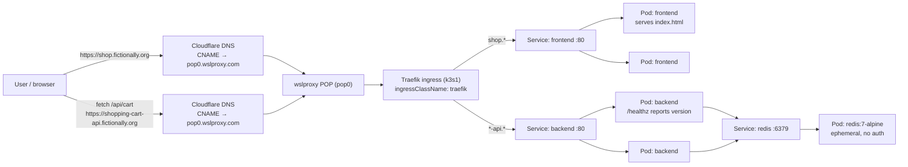
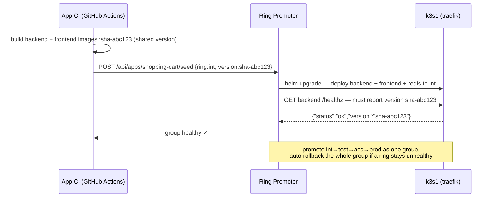
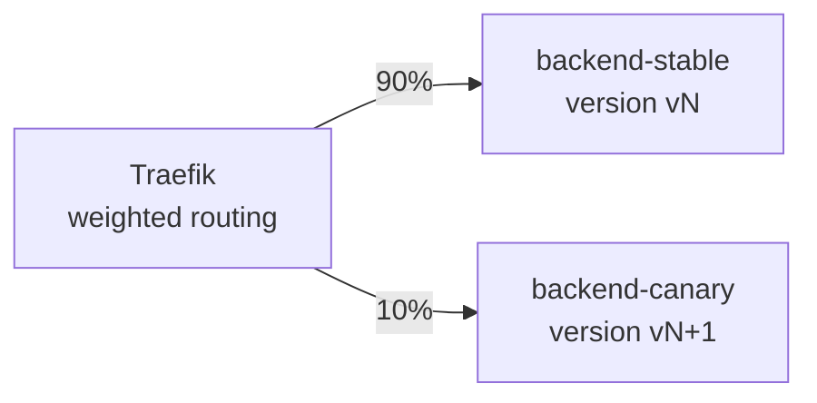
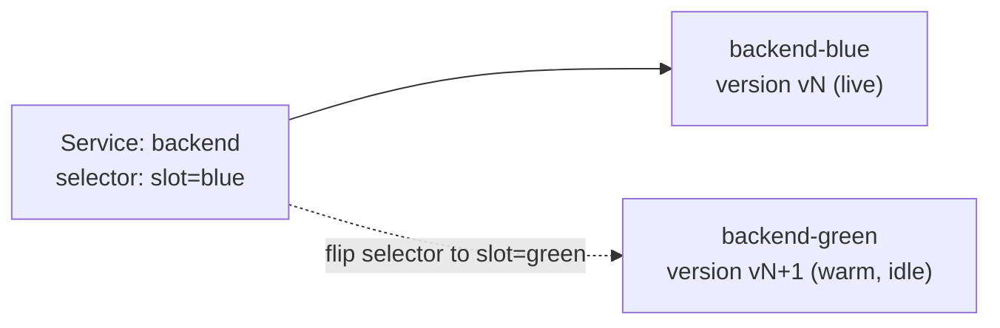

# shopping-cart — architecture

A multi-service Ring Promoter workload: a Go frontend and a Go backend that
share a Redis dependency, deployed by one Helm release and promoted together as
a **group**. It exists to demonstrate group promotion plus **canary** and
**blue/green** delivery on top of the ring flow — with the same version-aware
health check the whole academy is built on.

## Runtime shape



The backend never hard-fails on Redis: `GET /api/cart` returns an empty list and
`/readyz` returns `503 not-ready` when Redis is unreachable, so a Redis blip
takes the pod out of rotation instead of crash-looping it.

## Group promotion loop



## Why the version endpoint matters

The backend `/healthz` echoes `RP_VERSION`. The Ring Promoter ring config sets
`health_version_field: version`, so a ring only passes once the backend actually
serves the promoted build — a stale replica answering `200 OK` fails the check
and the group is rolled back. Frontend and backend carry the **same** version
tag, so the group is always coherent.

## Canary and blue/green

Both patterns build on the same idea: more than one Deployment behind the
routing layer, with the chart's component labels
(`app.kubernetes.io/component`) keeping them distinct.

### Canary — two Deployments + Traefik weighting

Run the current build (`stable`) and the promoted build (`canary`) side by side,
each its own Deployment, and split traffic by weight. Ring Promoter widens the
canary weight while `/healthz` reports the new version and metrics stay clean,
then promotes (100% canary) or rolls back (0%).



With Traefik this is a `TraefikService` that weights two backend Services:

```yaml
# traefik weighted round-robin across two backend Services
apiVersion: traefik.io/v1alpha1
kind: TraefikService
metadata:
  name: shopping-cart-backend
spec:
  weighted:
    services:
      - name: shopping-cart-backend-stable   # Deployment 1 (vN)
        port: 80
        weight: 90
      - name: shopping-cart-backend-canary   # Deployment 2 (vN+1)
        port: 80
        weight: 10
```

Shift the weights (`90/10` → `50/50` → `0/100`) to advance the canary, or back to
`100/0` to abort — no pod ever restarts.

### Blue/green — swap the Service selector

Run two complete Deployments, `blue` (live) and `green` (new), distinguished by
an extra `slot` label. The Service selects **one** slot at a time; cutover is a
single selector edit and is instantly reversible.



```bash
# green is deployed and healthy (its own pods, its own /readyz). Cut over:
kubectl patch service shopping-cart-backend \
  -p '{"spec":{"selector":{"app.kubernetes.io/component":"backend","slot":"green"}}}'

# instant rollback — flip the selector back to blue:
kubectl patch service shopping-cart-backend \
  -p '{"spec":{"selector":{"app.kubernetes.io/component":"backend","slot":"blue"}}}'
```

Because the selector change is atomic, all new connections move to green at once
and the old blue pods stay warm for an immediate rollback. Ring Promoter drives
the same patch, gated on the backend `/healthz` reporting the promoted version.
